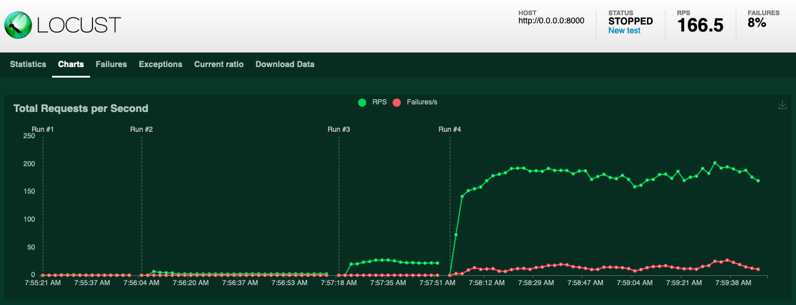

# Locust lab 1 

## Description 

Testing locust tool : load testing on webserver from docker container

Quick result :


## Usage :

first install dependancies :
``` 
pip install locust
```
or with the classic : 
```
pip install -r requirements.txt
```

- to start a test http server with python :
```
python3 -m http.server
```

- go to 0.0.0.0:8000 to see the http server
- go to 0.0.0.0:8089 to see locust admin panel and start testing

## source : 

- tutorial it-connect : https://www.it-connect.fr/serveur-web-tests-de-charge-en-python-avec-locust/